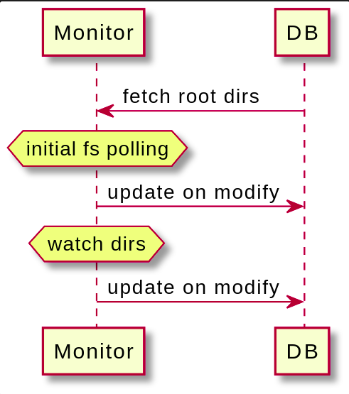
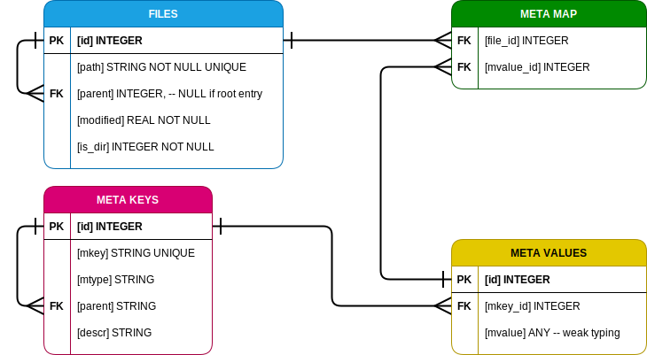

# ranga prototype

[[_TOC_]]

**ranga** is a CLI application for local file indexation and metadata management.
Current prototype is implemented with Python and PyQt.  

## Application design
under the hood the prototype functionality is split between the **client** and **monitor** modules.  

**monitor** module is responsible for indexation of the local file system and updating the database.  
Retrieving metadata from the files is the scope of [app.monitor.dumper](indexer/monitor/dumper.py) module.  

**client** module delivers the basic CLI, including the **monitor** control commands (**run**, **stop**, **port**, **status**, **update**).  
Other functionality includes retrieving data from the database with commands like **tables**, **show** and **search**, and
managing directory watchlist with **monitor** **add** and **remove** commands.

**add** and **remove** commands are are handled by the **monitor** server, or, if it is offline, by the **client** app,  
which operates directly on database in this case, but without recursive update and metadata extracting.  
**monitor** **update** command cannot be executed without launching server.

## CLI design

CLI is implemented using **argparse** library.   
CLI generation source: [cli_schema.yml](indexer/client/cli_schema.yml)

### comprehensive CLI tree
application subcommands and options

 - **search**: search metadata by keyword
    - **keywords**: filenames, metadata values
    - **category**: specific categories by which to search (filename, path, <metadata key>)
    - **exact**: search only for whole word matches
    - **mode**: sqlite3 output mode (csv, column, html, line, list)
    - **headless**: exclude header from the output
 - **show**: show table from database
    - **table**: database table or view
    - **mode**: sqlite3 output mode (csv, column, html, line, list)
    - **headless**: exclude header from the output
 - **tables**: list table names
 - **monitor**: local file system monitor server
    - **list**: list watched root dirs 
    - **add**: add directory to the watchlist
    - **remove**: remove directory from the watchlist
    - **update**: update file records in database
    - **run**: run monitor server
    - **stop**: stop monitor server
    - **port**: get/set port number
    - **status**: show monitor server status

## Monitor - DB communication 

## DB schema

db schema is designed as a polymorphic (i. e. attribute agnostic) 3-dimensional data registry.  
The only hardcoded attributes are the fields **path** and **modified** in the **Files** table.  
Metadata is stored in 3 tables:
 - MetaKeys:  stores metadata keys as objects
 - MetaData:  metadata key-to-value mapping
 - MetaMap:   file-to-metadata mapping  

Advantages over the hardcoded table:
 - correct handling of list records (e. g. for keys like **author**, **genre**, **category**), which is not supported in SQLite     
 - flexible structure, db module is independent from metadata attributes

## demo files

To download media assets for testing, run [scripts/get_media.sh](scripts/get_media.sh)  
You can add new asset urls to [scripts/links.txt](scripts/links.txt)  