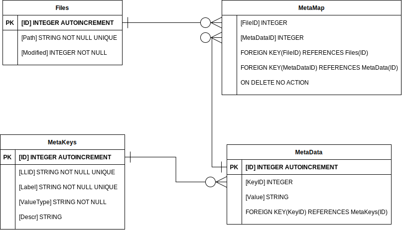
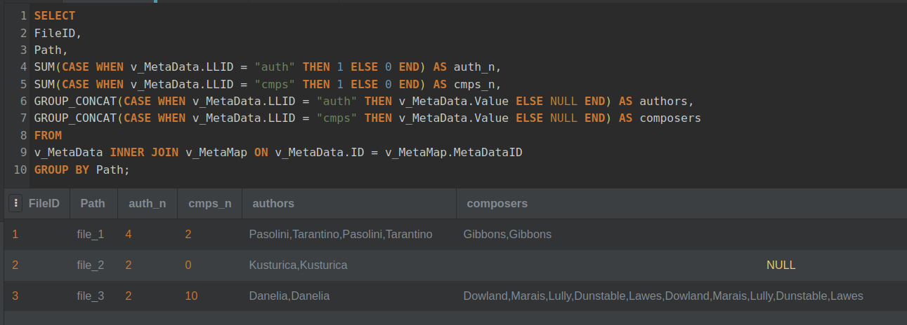

# PAM DATABASE DESDOC
[TOC]

## SCHEMA
db schema is designed as a polymorphic (i. e. attribute agnostic) 3-dimensional data registry.  
The only hardcoded attributes are the fields `path` and `modified` in the `Files` table.  
Metadata is stored in 3 tables:
 - MetaKeys:  stores metadata keys as objects
 - MetaData:  metadata key-to-value mapping
 - MetaMap:   file-to-metadata mapping  

Advantages over the hardcoded table:
 - correct handling of list records (e. g. for keys like `author`, `genre`, `category`), which is not supported in SQLite     
 - flexible structure, db module is independent from metadata attributes

### DIAGRAM


## SQL snippets

### UPSERT CLAUSE

an example of bad solution, ID is modified on update
```sql
INSERT OR REPLACE INTO Files(path, Modified)
VALUES
("some_path_1", 42),
("some_path_2", 43);
```

correct upsert clause, update only on conflict (here if file changed)
```sql
INSERT INTO Files(Path, Modified)
  VALUES
  ("some_path", 12345678)
  ON CONFLICT(Path) DO UPDATE SET
    Modified=excluded.Modified
  WHERE excluded.Modified>Files.Modified;
```

### UPDATE METAKEYS

```sql
INSERT INTO MetaKeys(LLID, label, valuetype, descr)
VALUES 
    ("auth", "author", "string", NULL),
    ("cmps", "composer", "string", "music composer"),
    ("lang", "language", "string", "dubbing lanuage") 
ON CONFLICT(LLID) DO UPDATE SET 
    label = excluded.label,
    valuetype = excluded.valuetype,
    descr = excluded.descr;
```
### UPDATE METADATA
```sql
INSERT INTO MetaData(KeyID, Value)
VALUES 
((SELECT ID FROM MetaKeys WHERE MetaKeys.LLID = "auth"), "Pasolini"),
((SELECT ID FROM MetaKeys WHERE MetaKeys.LLID = "cmps"), "Gibbons"),
((SELECT ID FROM MetaKeys WHERE MetaKeys.LLID = "lang"), "Klingon");
```

### UPDATE METAMAP

mapping files to meta, duplicates from different categories handled  
actual ids can be retieved on the app side, so the final query can be reduced
```sql
INSERT INTO MetaMap(FileID, MetaDataID)
VALUES 

((SELECT ID FROM Files WHERE Files.Path = "file_1" ),
(SELECT ID FROM v_MetaData WHERE LLID = "auth" AND Value = "Pasolini")),

((SELECT ID FROM Files WHERE Files.Path = "file_1"),
(SELECT ID FROM v_MetaData WHERE  LLID = "cmps" AND Value = "Gibbons"));
```

### COMPOSED TABLE QUERY

```sql
SELECT
FileID,
Path,
SUM(CASE WHEN v_MetaData.LLID = "auth" THEN 1 ELSE 0 END) as auth_n,
SUM(CASE WHEN v_MetaData.LLID = "cmps" THEN 1 ELSE 0 END) as cmps_n,
GROUP_CONCAT(CASE WHEN v_MetaData.LLID = "auth" THEN v_MetaData.Value ELSE NULL END) as authors,
GROUP_CONCAT(CASE WHEN v_MetaData.LLID = "cmps" THEN v_MetaData.Value ELSE NULL END) as composers
FROM
v_MetaData INNER JOIN v_MetaMap ON v_MetaData.ID = v_MetaMap.MetaDataID
GROUP BY Path;
```
example of query result (on running [db-demo.sql](db-demo.sql)):  



## USEFUL LINKS

https://sqliteonline.com/ - online SQLite IDE 